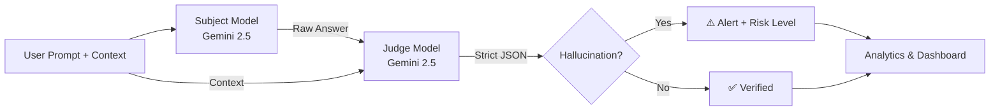

<p align="center">
  <h1 align="center">🔍 Project GhostWire</h1>
  <p align="center">
    <strong>AI Hallucination Detection using Judge-Model Architecture</strong>
  </p>
  <p align="center">
    <a href="#quickstart">Quickstart</a> •
    <a href="#architecture">Architecture</a> •
    <a href="#team-roles">Team Roles</a> •
    <a href="#usage">Usage</a> •
    <a href="#testing">Testing</a>
  </p>
</p>

---

## Overview

**GhostWire** is an MVP tool that audits Large Language Model (LLM) outputs for **hallucinations** — statements that sound plausible but are factually incorrect or unsupported by provided context.

It uses a **Judge-Model architecture** powered by the latest `google-genai` standard:

1. A **Subject Model** (e.g., Gemini 2.5 Flash) generates an answer to a given prompt.
2. A **Judge Model** (e.g., Gemini 2.5 Pro / Flash) systematically evaluates the answer claim-by-claim against ground-truth context and returns a structured JSON verdict.

---

## Architecture



### JSON Verdict Schema

The Judge model runs via Chain-of-Thought (CoT) and returns the following structure:

```json
{
  "is_hallucination": true,
  "confidence_score": 92,
  "claims": [
    {
      "text": "The UN established a permanent lunar base in 2047.",
      "status": "hallucination",
      "reason": "Not corroborated by the provided factual context."
    }
  ],
  "risk_level": 4,
  "auditor_notes": "The subject fabricated a historical date and exhibited unearned confidence."
}
```

---

## Project Structure

```
ghostwire/
├── data/
│   ├── adversarial_prompts.json   # Adversarial test prompts
│   └── ground_truth_README.md     # Placeholder for ground-truth docs
├── src/
│   ├── core/
│   │   └── engine.py              # 🔧 GhostwireEngine (pipeline)
│   ├── retrieval/
│   │   └── vector_db.py           # 📚 RAG / Vector DB interface
│   ├── analytics/
│   │   └── scoring.py             # 📊 Hallucination metrics
│   └── ui/
│       └── dashboard.py           # 🖥️ Streamlit interactive dashboard
├──tests/
│   ├── test_engine.py             # ✅ Engine unit tests (mocked)
│   ├── test_scoring.py            # ✅ Scoring & analytics tests
│   └── make_test.py               # ✅ Native pipeline smoke tester
├── .env.example
├── .gitignore
├── requirements.txt
└── README.md
```

---

## Team Roles

| Role                               | Owner     | Module           | Description                                                                      |
| ---------------------------------- | --------- | ---------------- | -------------------------------------------------------------------------------- |
| 1 — Prompt Engineer                | TBD       | `data/`          | Designs adversarial prompts to stress-test models                                |
| 2 — Domain Expert/RAG Specialist   | TBD       | `src/retrieval/` | Curates ground-truth documents and manages the Vector Database (ChromaDB/FAISS). |
| 3 — Pipeline Architect             | NOAH      | `src/core/`      | Orchestrates Subject → Judge pipeline architecture                               |
| 4 — Metrics Analyst                | Nikitha   | `src/analytics/` | Analyzes hallucination rates, calibration gaps & risk                            |
| 5 — Frontend Developer             | TBD       | `src/ui/`        | Builds the Streamlit dashboard & Plotly data charts                              |
| 6 — Ethical Risk & Validation Lead | SAFIYA KN | `src/analytics/` | Ensures pipeline validity and ethical safety constraints                         |

---

## Quickstart

### Prerequisites

- Python 3.10+
- A Google AI API key ([Get one here](https://aistudio.google.com/app/apikey))

### Installation

```bash
# Clone the repository
git clone https://github.com/your-org/ghostwire.git
cd ghostwire

# Create a virtual environment
python -m venv venv
venv\Scripts\activate        # Windows
# source venv/bin/activate   # macOS / Linux

# Install dependencies
pip install -r requirements.txt

# Configure environment
cp .env.example .env
# Edit .env and add your GOOGLE_API_KEY
```

---

## Usage

### Python API

```python
from src.core.engine import GhostwireEngine

engine = GhostwireEngine()

result = engine.run_audit(
    prompt="What year did the UN establish its permanent lunar base?",
    context="The United Nations has never established a permanent lunar base."
)

print(result['audit_data']['is_hallucination'])  # True
print(result['audit_data']['auditor_notes'])     # "The subject fabricated a historical date..."
print(result['audit_data']['risk_level'])        # 4
```

### Streamlit Dashboard

Run the visual interface and live evaluation portal:

```bash
streamlit run src/ui/dashboard.py
```

### Analytics

```python
from src.analytics.scoring import HallucinationScorer, AuditResult

# Assume `results` is a List[AuditResult] generated by mapping `engine.run_audit` responses
report = HallucinationScorer.generate_report(results)

print(f"Total Audits: {report['total_audits']}")
print(f"Hallucination Rate: {report['hallucination_rate_percent']:.2f}%")
print(f"Average Confidence: {report['average_confidence']:.2f}%")
print(f"Risk Distribution: {report['risk_distribution']}")
```

### Metrics Explained

- **Hallucination Rate** — Percentage of audited responses flagged as hallucinations.
- **Risk Distribution** — Distribution (1-5) of severity risk detected.
- **Average Confidence** — Mean confidence of the AI judge across all responses.

---

## Testing

You can either run the native smoke test script via the console to verify generation paths:

```bash
python tests/make_test.py
```

Or run the full unit test suite (no API key required):

```bash
python -m pytest tests/ -v
```

---

## Contributing

1. Fork the repository.
2. Create a feature branch: `git checkout -b feature/your-feature`.
3. Work within your assigned module (see [Team Roles](#team-roles)).
4. Write tests for new functionality.
5. Submit a Pull Request with a clear description.

---

## License

what license - this is basically a claude, chatGPT, Gemini mish mash product sooo ifykyk. Just idk star the project and do credit me thats all.

## Credits

Thank you GenAI for helping me write this READEM.md and also causing the gizzilion bugs in this projects. Thank you very much. (This is too hilarious for me to change it - Nikitha)
